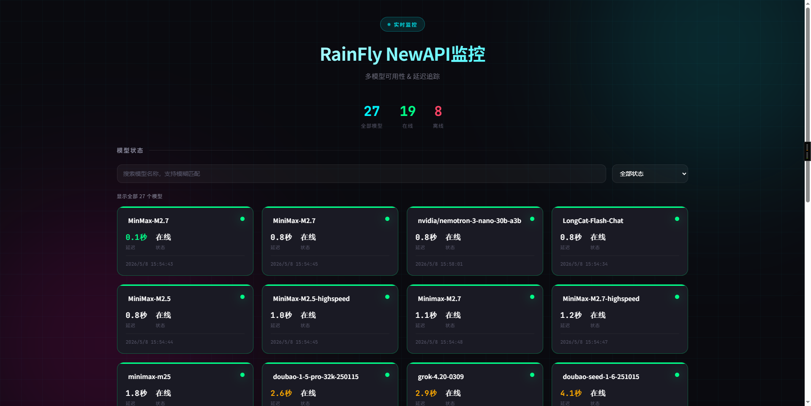
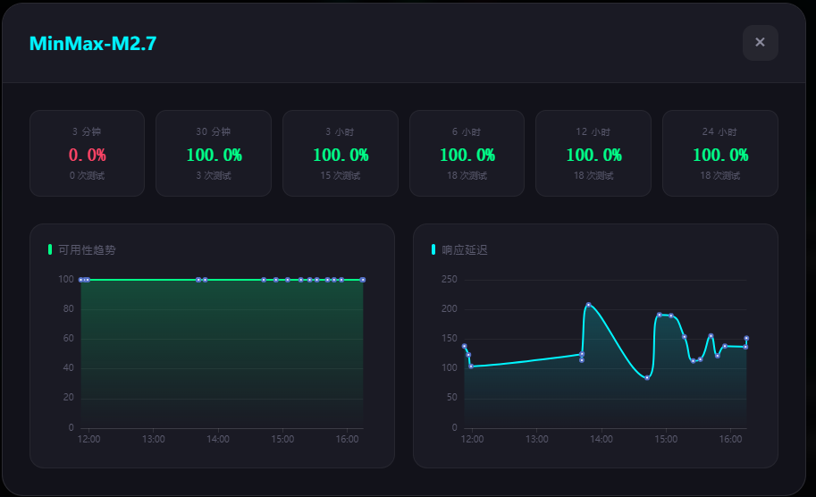

# NewAPI 模型监控 🔍

[](README.md)
[](LICENSE)

轻量级 Python + Flask + SQLite 多模型可用性监控看板。




## ✨ 功能特性

- 📡 自动从 NewAPI `/models` 拉取模型列表
- ⏰ 支持工作时间窗口（默认 8:00-18:00）
- 📊 多时间窗口可用性统计：3分钟 / 30分钟 / 3小时 / 6小时 / 12小时 / 24小时
- 📈 延迟与可用性趋势图表
- 🔎 模型名称搜索、在线/离线筛选
- 💾 SQLite 持久化 + 自动清理过期数据

## 🚀 快速启动

```bash
# 安装依赖
pip install -r requirements.txt

# 复制配置并修改
cp config.yaml.example config.yaml
# 编辑 config.yaml 填入你的 NewAPI 地址和 API key

# Linux/macOS
./start.sh

# Windows
start.bat
```

访问 **http://localhost:5000**

## ⚙️ 配置说明

```yaml
newapi:
  endpoint: "http://你的API地址:3000/v1"
  api_key: "sk-你的密钥"
  timeout: 60

scheduler:
  interval_minutes: 3      # 测试间隔（分钟）
  time_window:
    start_hour: 8          # 开始时间
    end_hour: 18           # 结束时间

database:
  path: "data/monitor.db"  # 数据库路径

retention:
  days: 30                 # 数据保留天数

web:
  host: "127.0.0.1"
  port: 5000
```

或使用环境变量：
```bash
export NEWAPI_API_KEY="sk-你的密钥"
export NEWAPI_ENDPOINT="http://你的API地址:3000/v1"
```

## 🌐 API 接口

| 接口 | 说明 |
|------|------|
| `GET /api/models` | 所有模型（按可用性+延迟排序） |
| `GET /api/status` | 实时状态映射 |
| `GET /api/availability` | 多时间窗口可用性统计 |
| `GET /api/history` | 最近24小时历史数据 |
| `GET /api/models/<name>/availability` | 单模型可用性 |
| `GET /api/models/<name>/history` | 单模型历史 |

## 📁 项目结构

```
├── monitor/
│   ├── agent.py      # 定时调度与健康检查
│   ├── adapter.py    # NewAPI 客户端
│   ├── database.py   # SQLite 数据操作
│   └── config.py     # 配置加载
├── web/
│   └── app.py        # Flask API 服务
├── data/
│   └── monitor.db    # SQLite 数据库
├── config.yaml       # 配置文件
├── requirements.txt  # Python 依赖
└── start.sh / start.bat  # 启动脚本
```

## 🛡️ 安全说明

- ✅ `config.yaml` 已加入 `.gitignore`（含 API key）
- ✅ `.gitignore` 排除数据库、日志、缓存文件
- ✅ 支持环境变量覆盖敏感配置

## 📜 开源协议

MIT License - 可免费用于商业和个人项目。
